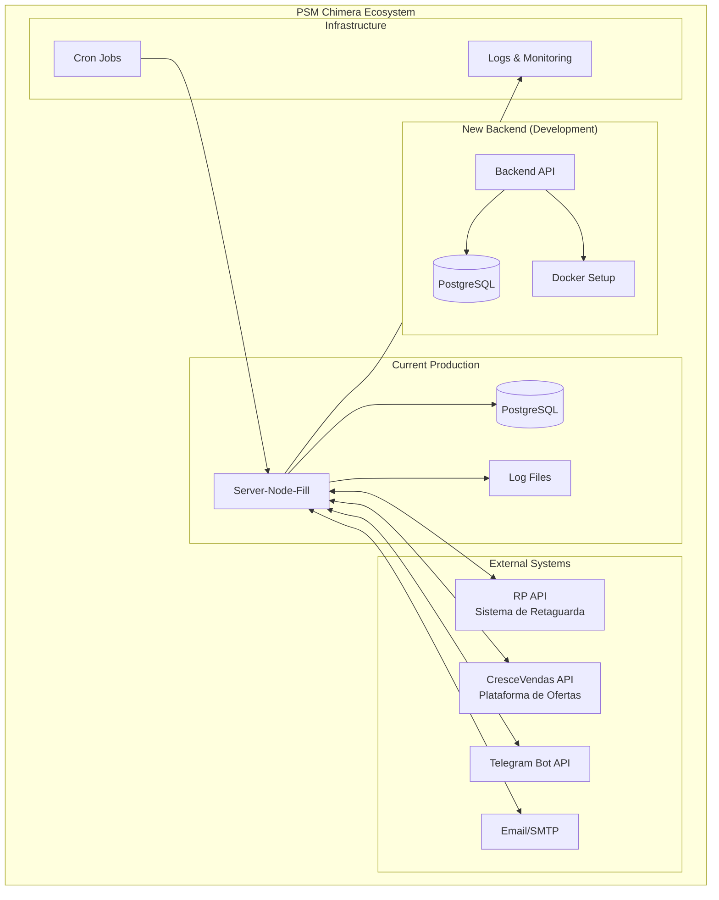
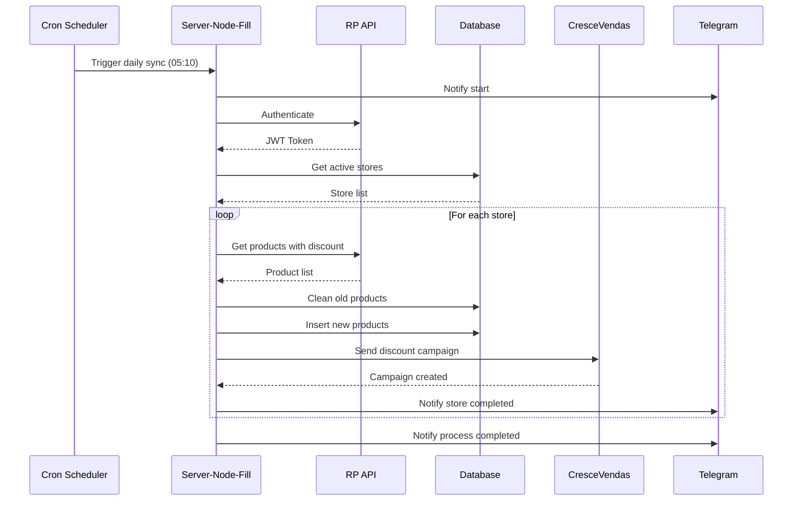
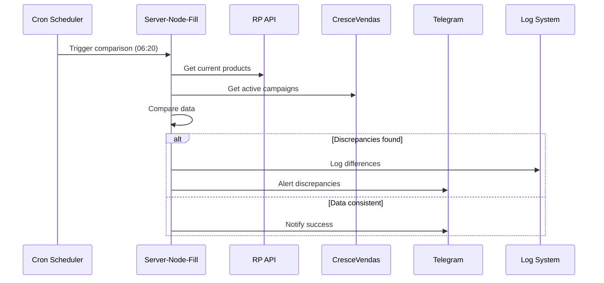
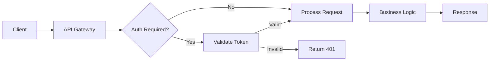
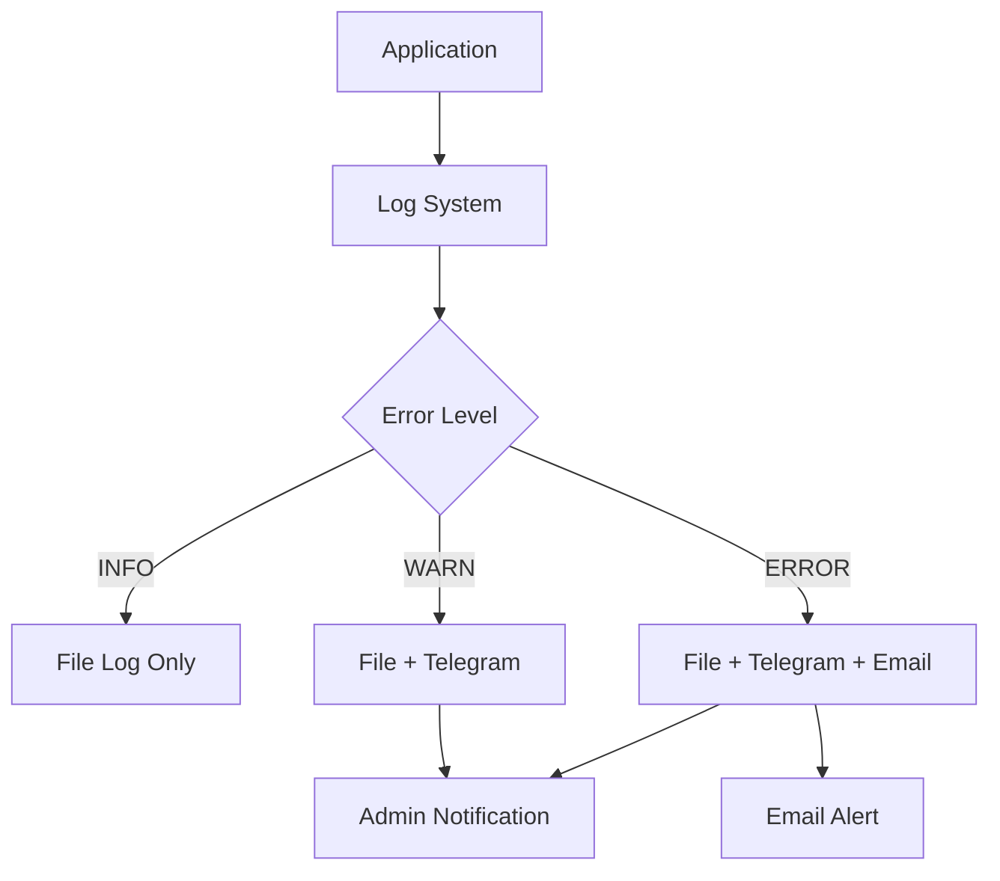
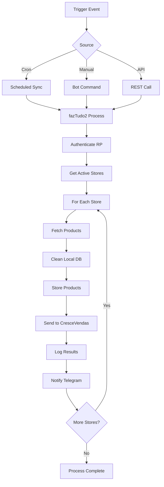
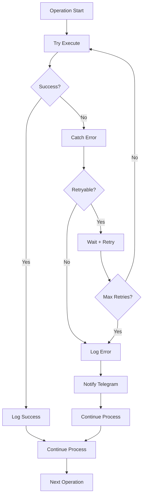

# 🏛️ Visão Geral da Arquitetura - PSM Chimera

## 📋 Introdução

O **PSM Chimera** é um ecossistema de automação empresarial composto por múltiplos componentes que trabalham em conjunto para sincronizar dados entre sistemas legados e plataformas modernas.

---

## 🎯 Objetivos do Sistema

### Primários

- **Automação Completa:** Eliminar intervenção manual na sincronização de descontos
- **Integração Multi-Sistema:** Conectar RP, CresceVendas e Telegram de forma inteligente
- **Monitoramento 24/7:** Acompanhamento contínuo de todas as operações
- **Confiabilidade:** Garantir 99.9% de uptime e consistência de dados

### Secundários

- **Escalabilidade:** Suportar crescimento da rede de lojas
- **Observabilidade:** Logs detalhados e métricas de performance
- **Manutenibilidade:** Código limpo e documentação completa
- **Flexibilidade:** Adaptação rápida a mudanças de negócio

---

## 🏗️ Componentes da Arquitetura

### 1. Backend (Novo)

```plaintxt
/backend/
├── src/
│   ├── controllers/     # Lógica de negócio
│   ├── services/        # Integrações externas
│   ├── routes/          # API REST endpoints
│   ├── utils/           # Utilitários
│   └── database/
│       ├── prisma/      # Schema e migrations
│       └── generated/   # Prisma Client
├── docker-compose.yaml  # Orquestração Docker
├── Dockerfile          # Container definition
└── package.json        # Dependências Node.js
```

**Características:**

- **Framework:** Node.js + TypeScript + Express
- **Database Layer:** Kysely ORM com PostgreSQL
- **Query System:** Middleware unificado para filtros, paginação e ordenação
- **Architecture:** Layered architecture com separação clara de responsabilidades
- **Propósito:** Nova arquitetura moderna para expansão e manutenibilidade
- **Status:** Em desenvolvimento inicial

### 2. Server-Node-Fill (Atual)

```plaintext
/server-node-fill/
├── src/
│   ├── controllers/     # Business logic
│   │   ├── TelegramBotController.ts
│   │   ├── fazTudo2.ts  # Main sync script
│   │   ├── fazTudo3.ts  # Cleanup script
│   │   └── CronController.ts
│   ├── services/        # External integrations
│   │   ├── RpService.ts
│   │   ├── CrescevendasService.ts
│   │   └── NodeMailerService.ts
│   ├── models/          # Data models
│   ├── routes/          # API routes
│   └── logs/            # Application logs
├── prisma/              # Database schema
└── docker/              # Docker configuration
```

**Características:**

- **Framework:** Node.js + TypeScript + Express
- **Database:** PostgreSQL (prod) + SQLite (dev)
- **Integrations:** RP API, CresceVendas API, Telegram Bot
- **Status:** Sistema principal em produção

---

## 🌐 Arquitetura de Sistemas



---

## 🔄 Fluxo de Dados Principal

### 1. Sincronização Automática (fazTudo2)



### 2. Comparação e Auditoria (comparaTudo)



---

## 🔧 Tecnologias Utilizadas

### Backend Technologies

| Componente | Tecnologia | Versão | Propósito |
|------------|------------|--------|-----------|
| Runtime | Node.js | 20+ | Execução JavaScript |
| Language | TypeScript | 5.3+ | Type safety |
| Framework | Express | 4.18+ | Web server |
| ORM | Kysely | 0.27+ | Type-safe SQL query builder |
| Database | PostgreSQL | 17.0 | Data persistence |
| Container | Docker | Latest | Containerization |
| Scheduler | node-cron | 3.0+ | Task scheduling |
| Query System | Custom Middleware | - | Unified query processing |

### Integration Technologies

| Serviço | Tecnologia | Versão | Propósito |
|---------|------------|--------|-----------|
| HTTP Client | Axios | 1.6+ | API calls |
| Bot Framework | node-telegram-bot-api | 0.65+ | Telegram integration |
| Email | Nodemailer | 6.9+ | Email sending |
| IMAP | imap | 0.8+ | Email reading |
| Logging | fs (native) | - | File logging |

---

## 🏛️ Padrões Arquiteturais

### 1. Layered Architecture

```plaintext
┌─────────────────────────┐
│     Presentation        │  Routes, Controllers
├─────────────────────────┤
│      Middleware         │  Query Middleware, Auth, Validation
├─────────────────────────┤
│      Business Logic     │  Services, Use Cases
├─────────────────────────┤
│     Data Access         │  Query Builders, ORM (Kysely)
├─────────────────────────┤
│      Database           │  PostgreSQL
└─────────────────────────┘
```

### 2. Integration Patterns

- **API Gateway Pattern:** Single entry point for external APIs
- **Circuit Breaker:** Fault tolerance for external services
- **Retry Pattern:** Automatic retry with exponential backoff
- **Observer Pattern:** Event-driven notifications via Telegram

### 3. Query Processing Patterns

- **Unified Middleware:** Single middleware for filters, pagination, and sorting
- **Column Mapping:** Database column abstraction from API fields
- **Type-Safe Queries:** Kysely-based type-safe query building
- **Case-Insensitive Search:** ILIKE operator for PostgreSQL text search

### 4. Data Patterns

- **Repository Pattern:** Abstraction for data access
- **Unit of Work:** Transaction management
- **Command Query Separation:** Separate read/write operations
- **Query Builder Pattern:** Reusable query construction helpers

---

## 🔐 Segurança e Autenticação

### Authentication Flow



### Security Measures

- **Token-based Authentication:** JWT tokens for RP API
- **API Key Authentication:** CresceVendas custom headers
- **User Validation:** Telegram user whitelist
- **Network Security:** Docker network isolation
- **Data Encryption:** PostgreSQL SSL connections
- **Audit Logging:** Complete operation logs

---

## 📊 Monitoramento e Observabilidade

### Logging Strategy

```plaintext
Application Logs
├── Daily Files (log-YYYY-MM-DD.txt)
├── Structured Format (timestamp + message)
├── Different Log Levels (info, warn, error)
├── Automatic Rotation (7-day retention)
└── Real-time Telegram Alerts
```

### Metrics Collected

- **Performance Metrics:** API response times, throughput
- **Business Metrics:** Products synced, campaigns created
- **System Metrics:** Memory usage, CPU usage
- **Error Metrics:** Error rates, failure types

### Alerting



---

## 🚀 Deployment e Infrastructure

### Current Deployment

- **Environment:** On-premise servers
- **Database:** PostgreSQL on dedicated server
- **Application:** Node.js with PM2 process manager
- **Monitoring:** File-based logging + Telegram alerts
- **Backup:** Database backup via cron jobs

### Planned Improvements (New Backend)

- **Containerization:** Full Docker deployment
- **Orchestration:** Docker Compose for local dev
- **CI/CD:** Automated testing and deployment
- **Monitoring:** Structured logging with external tools
- **Scalability:** Horizontal scaling capability

---

## 🔄 Data Flow Architecture

### Synchronization Pipeline



### Error Handling Flow



---

## 📈 Performance Considerations

### Optimization Strategies

1. **Database Optimization**

   - Indexed queries for frequent lookups
   - Connection pooling
   - Query optimization with Prisma

2. **API Performance**

   - Unified query middleware for consistent processing
   - Type-safe queries with Kysely
   - Efficient pagination with offset/limit
   - Case-insensitive search with PostgreSQL ILIKE
   - Parallel query execution for count and data
   - Column mapping for flexible API design

3. **Memory Management**

   - Streaming for large file operations
   - Garbage collection optimization
   - Memory leak prevention

### Scalability Plans

- **Horizontal Scaling:** Multiple worker instances
- **Database Scaling:** Read replicas for reporting
- **Caching Layer:** Redis for frequently accessed data
- **Load Balancing:** Distribute load across instances

---

## 🔮 Roadmap e Evolução

### Phase 1: Current State (Completed)

- ✅ Server-Node-Fill operational
- ✅ Full integration with RP and CresceVendas
- ✅ Telegram Bot monitoring
- ✅ Automated scheduling

### Phase 2: New Backend (In Progress)

- ✅ Modern TypeScript backend with Express
- ✅ Kysely ORM for type-safe database operations
- ✅ Unified query middleware system
- ✅ Enhanced API design with consistent patterns
- 🚧 Docker containerization
- 🚧 Improved database schema

### Phase 3: Enhancement (Planned)

- 📋 Microservices architecture
- 📋 Advanced monitoring (Prometheus/Grafana)
- 📋 Web dashboard
- 📋 Advanced analytics

### Phase 4: Enterprise (Future)

- 📋 Multi-tenant support
- 📋 Advanced security features
- 📋 Cloud deployment
- 📋 Mobile applications

---

## 🎯 Conclusão

O **PSM Chimera** representa uma solução empresarial robusta que demonstra:

### Pontos Fortes

- **Automação Completa:** Elimina trabalho manual repetitivo
- **Integração Inteligente:** Conecta sistemas heterogêneos
- **Monitoramento Avançado:** Visibilidade total das operações
- **Confiabilidade:** Operação 24/7 com alta disponibilidade

### Características Técnicas

- **Arquitetura Modular:** Componentes bem definidos e separados
- **Padrões Modernos:** TypeScript, Kysely, Docker, Unified Middleware
- **Type Safety:** Queries type-safe com validação em tempo de execução
- **Query System:** Sistema unificado de filtros, paginação e ordenação
- **Observabilidade:** Logging detalhado e alertas em tempo real
- **Manutenibilidade:** Código limpo e documentação completa

### Impacto no Negócio

- **Eficiência Operacional:** Redução drástica de trabalho manual
- **Consistência de Dados:** Sincronização automática e confiável
- **Visibilidade:** Monitoramento em tempo real de todas as operações
- **Escalabilidade:** Suporte ao crescimento da rede de lojas

---

*Documentação da arquitetura PSM Chimera*
*Última atualização: 23 de dezembro de 2024*
