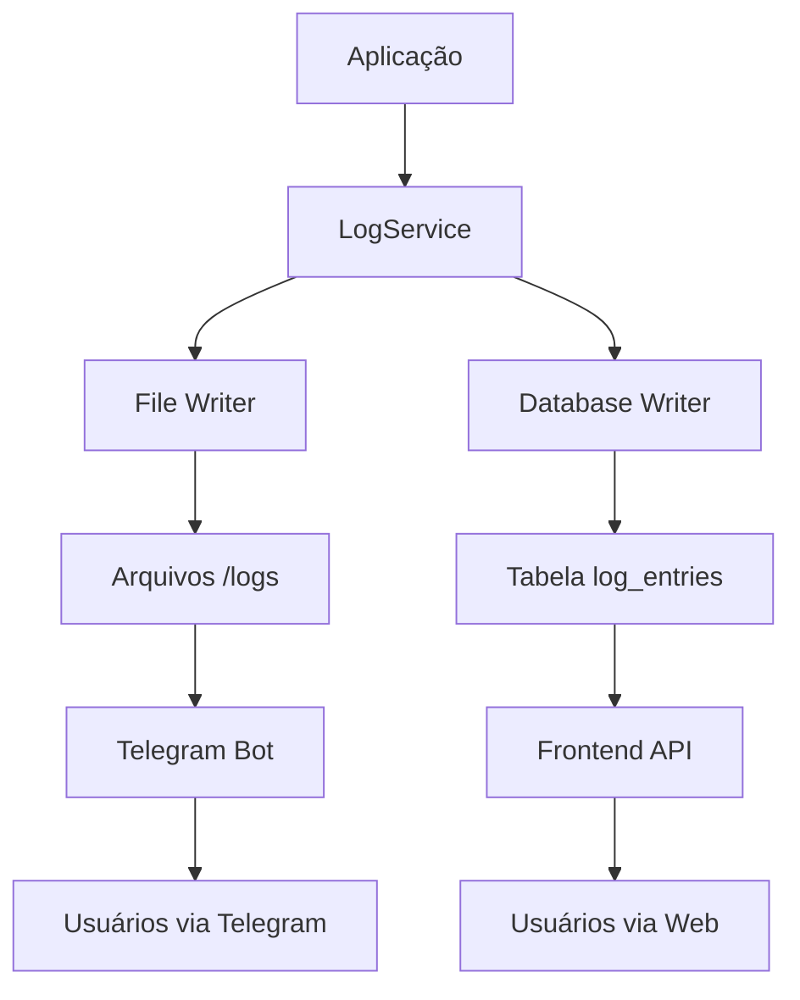

# 📋 Sistema de Logs Unificado - Design Document

**Data:** 30 de setembro de 2025  
**Versão:** 1.0.0  
**Projeto:** PSM Chimera  

---

## 🎯 **Objetivo**

Criar um sistema de logs unificado que mantenha a funcionalidade atual do **server-node-fill** (logs em arquivos para Telegram Bot) mas adicione **acesso via frontend** para visualização e monitoramento em tempo real.

---

## 📊 **Análise do Sistema Atual (server-node-fill)**

### **Funcionalidades Existentes:**
- ✅ **Logs por arquivo diário:** `log-YYYY-MM-DD.txt`
- ✅ **Limpeza automática:** Remove logs > 7 dias
- ✅ **Timezone local:** UTC-3 (Brasil)
- ✅ **Acesso via Telegram:** Bot pode ler e enviar logs
- ✅ **Append contínuo:** Logs são adicionados em tempo real

### **Estrutura Atual:**
```
server-node-fill/src/logs/
├── log-2024-09-28.txt
├── log-2024-09-29.txt
├── log-2024-09-30.txt (hoje)
└── [arquivos removidos automaticamente após 7 dias]
```

### **Formato de Log Atual:**
```
14:32:45 🚀 [SYNC] Iniciando sincronização de descontos...
14:32:48 📊 [RP] Buscando produtos para loja: 12345678901234
14:33:02 ✅ [RP] 250 produtos encontrados com desconto
14:33:15 📤 [CV] Enviando 250 produtos para CresceVendas
14:33:20 ✅ [SYNC] Sincronização concluída com sucesso
```

---

## 🏗️ **Arquitetura do Sistema Unificado**

### **Conceito:**
**Dual-Channel Logging:** Sistema que escreve logs simultaneamente em:
1. **Arquivos** (compatibilidade com Telegram Bot)
2. **Banco de dados** (acesso via API para frontend)



---

## 🗄️ **Estrutura de Dados**

### **1. Tabela de Logs no Banco**

```sql
-- Adicionar ao schema.prisma
model LogEntry {
  id          String   @id @default(uuid())
  timestamp   DateTime @default(now())
  level       LogLevel
  category    String   // "SYNC", "RP", "CV", "TELEGRAM", "SYSTEM"
  message     String
  metadata    Json?    // Dados extras: store_id, job_id, execution_id, etc.
  session_id  String?  // Para agrupar logs de uma mesma execução
  source      String   @default("api") // "api", "cron", "manual"
  
  created_at  DateTime @default(now())
  
  @@index([timestamp])
  @@index([category])
  @@index([level])
  @@index([session_id])
  @@map("log_entries")
}

enum LogLevel {
  DEBUG
  INFO
  WARN
  ERROR
  SUCCESS
}
```

### **2. Estrutura de Arquivos (mantida)**

```
backend/src/logs/
├── log-2025-09-28.txt
├── log-2025-09-29.txt
├── log-2025-09-30.txt
└── cleanup automático após 7 dias
```

---

## 🔧 **Implementação Backend**

### **1. Service de Logs Unificado**

```typescript
// src/services/log.service.ts
export class LogService {
  private static instance: LogService;
  private db = DatabaseFactory.getDatabase();

  static getInstance(): LogService {
    if (!LogService.instance) {
      LogService.instance = new LogService();
    }
    return LogService.instance;
  }

  async log(
    level: LogLevel,
    category: string,
    message: string,
    metadata?: Record<string, any>,
    sessionId?: string
  ): Promise<void> {
    const timestamp = new Date();
    
    // 1. Escrever no arquivo (compatibilidade Telegram)
    await this.writeToFile(timestamp, level, category, message);
    
    // 2. Escrever no banco (acesso frontend)
    await this.writeToDatabase(level, category, message, metadata, sessionId);
  }

  private async writeToFile(
    timestamp: Date,
    level: LogLevel,
    category: string,
    message: string
  ): Promise<void> {
    const logPath = `./src/logs/log-${timestamp.toISOString().slice(0, 10)}.txt`;
    const timeStr = this.formatTimestamp(timestamp);
    const levelIcon = this.getLevelIcon(level);
    const formattedMessage = `${timeStr} ${levelIcon} [${category}] ${message}\n`;
    
    await fs.appendFile(logPath, formattedMessage);
  }

  private async writeToDatabase(
    level: LogLevel,
    category: string,
    message: string,
    metadata?: Record<string, any>,
    sessionId?: string
  ): Promise<void> {
    await this.db.insertInto('log_entries').values({
      id: randomUUID(),
      level,
      category,
      message,
      metadata: JSON.stringify(metadata || {}),
      session_id: sessionId,
      source: 'api',
      timestamp: new Date(),
      created_at: new Date()
    }).execute();
  }

  // Métodos de conveniência
  async info(category: string, message: string, metadata?: any, sessionId?: string) {
    return this.log('INFO', category, message, metadata, sessionId);
  }

  async success(category: string, message: string, metadata?: any, sessionId?: string) {
    return this.log('SUCCESS', category, message, metadata, sessionId);
  }

  async error(category: string, message: string, metadata?: any, sessionId?: string) {
    return this.log('ERROR', category, message, metadata, sessionId);
  }

  async warn(category: string, message: string, metadata?: any, sessionId?: string) {
    return this.log('WARN', category, message, metadata, sessionId);
  }

  // Limpeza automática
  async cleanupOldLogs(): Promise<number> {
    const sevenDaysAgo = new Date();
    sevenDaysAgo.setDate(sevenDaysAgo.getDate() - 7);

    // Limpar arquivos
    const filesRemoved = await this.cleanupLogFiles();
    
    // Limpar banco
    const dbResult = await this.db
      .deleteFrom('log_entries')
      .where('timestamp', '<', sevenDaysAgo)
      .execute();

    await this.info('SYSTEM', `Limpeza concluída: ${filesRemoved} arquivos, ${dbResult.numDeletedRows} registros do banco`);
    
    return filesRemoved + Number(dbResult.numDeletedRows);
  }

  // Recuperar logs para frontend
  async getLogs(filters: LogFilters): Promise<LogEntry[]> {
    let query = this.db.selectFrom('log_entries').selectAll();

    if (filters.startDate) {
      query = query.where('timestamp', '>=', filters.startDate);
    }
    
    if (filters.endDate) {
      query = query.where('timestamp', '<=', filters.endDate);
    }
    
    if (filters.level) {
      query = query.where('level', '=', filters.level);
    }
    
    if (filters.category) {
      query = query.where('category', '=', filters.category);
    }
    
    if (filters.sessionId) {
      query = query.where('session_id', '=', filters.sessionId);
    }

    return query
      .orderBy('timestamp', 'desc')
      .limit(filters.limit || 100)
      .execute();
  }

  // Logs em tempo real via WebSocket
  private eventEmitter = new EventEmitter();

  onLogAdded(callback: (log: LogEntry) => void) {
    this.eventEmitter.on('log-added', callback);
  }
}
```

### **2. Controller de Logs**

```typescript
// src/controllers/log.controller.ts
export class LogController {
  static async getLogs(req: AuthenticatedRequest, res: Response) {
    try {
      const filters: LogFilters = {
        startDate: req.query.startDate ? new Date(req.query.startDate as string) : undefined,
        endDate: req.query.endDate ? new Date(req.query.endDate as string) : undefined,
        level: req.query.level as LogLevel,
        category: req.query.category as string,
        sessionId: req.query.sessionId as string,
        limit: req.query.limit ? parseInt(req.query.limit as string) : 100,
      };

      const logService = LogService.getInstance();
      const logs = await logService.getLogs(filters);

      return res.json({
        success: true,
        data: logs,
        total: logs.length,
      });
    } catch (error) {
      return res.status(500).json({
        success: false,
        message: 'Erro ao buscar logs',
        error: error.message,
      });
    }
  }

  static async getLogsBySession(req: AuthenticatedRequest, res: Response) {
    try {
      const { sessionId } = req.params;
      const logService = LogService.getInstance();
      
      const logs = await logService.getLogs({ sessionId });

      return res.json({
        success: true,
        data: logs,
        session_id: sessionId,
      });
    } catch (error) {
      return res.status(500).json({
        success: false,
        message: 'Erro ao buscar logs da sessão',
        error: error.message,
      });
    }
  }

  static async getLogCategories(req: AuthenticatedRequest, res: Response) {
    try {
      const logService = LogService.getInstance();
      const categories = await logService.getCategories();

      return res.json({
        success: true,
        data: categories,
      });
    } catch (error) {
      return res.status(500).json({
        success: false,
        message: 'Erro ao buscar categorias',
        error: error.message,
      });
    }
  }

  // Logs em tempo real via Server-Sent Events
  static async streamLogs(req: AuthenticatedRequest, res: Response) {
    res.writeHead(200, {
      'Content-Type': 'text/event-stream',
      'Cache-Control': 'no-cache',
      'Connection': 'keep-alive',
      'Access-Control-Allow-Origin': '*',
    });

    const logService = LogService.getInstance();
    
    const callback = (log: LogEntry) => {
      res.write(`data: ${JSON.stringify(log)}\n\n`);
    };

    logService.onLogAdded(callback);

    req.on('close', () => {
      logService.removeListener('log-added', callback);
    });
  }
}
```

### **3. Integração com Telegram (mantida)**

```typescript
// src/services/telegram.service.ts - EXPANDIR
export class TelegramService {
  // Métodos existentes...

  async sendLogFile(chatId: number, date?: string): Promise<void> {
    const logDate = date || new Date().toISOString().slice(0, 10);
    const logPath = `./src/logs/log-${logDate}.txt`;
    
    if (fs.existsSync(logPath)) {
      await this.bot.sendDocument(chatId, logPath, {
        caption: `📋 Log do dia ${logDate}`,
      });
    } else {
      await this.sendMessage(chatId, `❌ Log do dia ${logDate} não encontrado`);
    }
  }

  async sendRecentLogs(chatId: number, lines: number = 50): Promise<void> {
    const today = new Date().toISOString().slice(0, 10);
    const logPath = `./src/logs/log-${today}.txt`;
    
    if (fs.existsSync(logPath)) {
      const content = fs.readFileSync(logPath, 'utf8');
      const recentLines = content.split('\n').slice(-lines).join('\n');
      
      await this.sendMessage(chatId, `📋 *Últimas ${lines} linhas do log:*\n\`\`\`\n${recentLines}\n\`\`\``, {
        parse_mode: 'Markdown',
      });
    }
  }
}
```

---

## 🎨 **Implementação Frontend**

### **1. Types para Logs**

```typescript
// src/types/log.ts
export interface LogEntry {
  id: string;
  timestamp: Date;
  level: LogLevel;
  category: string;
  message: string;
  metadata?: Record<string, any>;
  session_id?: string;
  source: string;
}

export type LogLevel = 'DEBUG' | 'INFO' | 'WARN' | 'ERROR' | 'SUCCESS';

export interface LogFilters {
  startDate?: Date;
  endDate?: Date;
  level?: LogLevel;
  category?: string;
  sessionId?: string;
  limit?: number;
}
```

### **2. API Controller do Frontend**

```typescript
// src/controllers/log.controller.ts
export class LogAPIController {
  static async getLogs(filters: LogFilters): Promise<LogEntry[]> {
    const params = new URLSearchParams();
    
    if (filters.startDate) params.append('startDate', filters.startDate.toISOString());
    if (filters.endDate) params.append('endDate', filters.endDate.toISOString());
    if (filters.level) params.append('level', filters.level);
    if (filters.category) params.append('category', filters.category);
    if (filters.sessionId) params.append('sessionId', filters.sessionId);
    if (filters.limit) params.append('limit', filters.limit.toString());

    const response = await fetch(`/api/v1/logs?${params.toString()}`);
    const data = await response.json();
    
    return data.data;
  }

  static async getLogsBySession(sessionId: string): Promise<LogEntry[]> {
    const response = await fetch(`/api/v1/logs/session/${sessionId}`);
    const data = await response.json();
    
    return data.data;
  }

  static async streamLogs(onLog: (log: LogEntry) => void): Promise<EventSource> {
    const eventSource = new EventSource('/api/v1/logs/stream');
    
    eventSource.onmessage = (event) => {
      const log = JSON.parse(event.data);
      onLog(log);
    };

    return eventSource;
  }
}
```

### **3. Página de Logs**

```typescript
// src/pages/LogsPage/index.tsx
export function LogsPage() {
  const [logs, setLogs] = useState<LogEntry[]>([]);
  const [filters, setFilters] = useState<LogFilters>({});
  const [loading, setLoading] = useState(false);
  const [realTime, setRealTime] = useState(false);
  const [eventSource, setEventSource] = useState<EventSource | null>(null);

  // Carregar logs
  const loadLogs = useCallback(async () => {
    setLoading(true);
    try {
      const data = await LogAPIController.getLogs(filters);
      setLogs(data);
    } catch (error) {
      toast.error('Erro ao carregar logs');
    } finally {
      setLoading(false);
    }
  }, [filters]);

  // Logs em tempo real
  const toggleRealTime = async () => {
    if (realTime) {
      eventSource?.close();
      setEventSource(null);
    } else {
      const es = await LogAPIController.streamLogs((log) => {
        setLogs(prev => [log, ...prev.slice(0, 99)]); // Manter apenas 100 logs
      });
      setEventSource(es);
    }
    setRealTime(!realTime);
  };

  return (
    <div className="container mx-auto p-6">
      <div className="flex justify-between items-center mb-6">
        <h1 className="text-2xl font-bold">📋 Logs do Sistema</h1>
        
        <div className="flex gap-2">
          <Button
            variant={realTime ? "destructive" : "default"}
            onClick={toggleRealTime}
          >
            {realTime ? "🔴 Parar" : "🟢 Tempo Real"}
          </Button>
          
          <Button onClick={loadLogs} disabled={loading}>
            {loading ? "⏳ Carregando..." : "🔄 Atualizar"}
          </Button>
        </div>
      </div>

      {/* Filtros */}
      <LogFilters 
        filters={filters} 
        onFiltersChange={setFilters}
        onApply={loadLogs}
      />

      {/* Lista de Logs */}
      <LogViewer 
        logs={logs} 
        loading={loading}
        realTime={realTime}
      />
    </div>
  );
}
```

### **4. Componentes de Log**

```typescript
// src/components/logs/LogViewer.tsx
export function LogViewer({ logs, loading, realTime }: LogViewerProps) {
  return (
    <div className="bg-gray-900 text-green-400 font-mono text-sm rounded-lg p-4 max-h-96 overflow-y-auto">
      {realTime && (
        <div className="flex items-center gap-2 text-green-500 mb-2">
          <div className="w-2 h-2 bg-green-500 rounded-full animate-pulse"></div>
          <span>Tempo Real Ativo</span>
        </div>
      )}
      
      {loading && <div className="text-yellow-400">⏳ Carregando logs...</div>}
      
      {logs.map((log) => (
        <LogEntry key={log.id} log={log} />
      ))}
      
      {logs.length === 0 && !loading && (
        <div className="text-gray-500">Nenhum log encontrado</div>
      )}
    </div>
  );
}

// src/components/logs/LogEntry.tsx
export function LogEntry({ log }: { log: LogEntry }) {
  const getLevelColor = (level: LogLevel) => {
    switch (level) {
      case 'ERROR': return 'text-red-400';
      case 'WARN': return 'text-yellow-400';
      case 'SUCCESS': return 'text-green-400';
      case 'INFO': return 'text-blue-400';
      default: return 'text-gray-400';
    }
  };

  const getLevelIcon = (level: LogLevel) => {
    switch (level) {
      case 'ERROR': return '❌';
      case 'WARN': return '⚠️';
      case 'SUCCESS': return '✅';
      case 'INFO': return 'ℹ️';
      default: return '📝';
    }
  };

  return (
    <div className="py-1 hover:bg-gray-800 px-2 rounded">
      <span className="text-gray-500">
        {new Date(log.timestamp).toLocaleTimeString()}
      </span>
      <span className={`ml-2 ${getLevelColor(log.level)}`}>
        {getLevelIcon(log.level)} [{log.category}]
      </span>
      <span className="ml-2 text-gray-300">
        {log.message}
      </span>
      
      {log.metadata && Object.keys(log.metadata).length > 0 && (
        <LogMetadata metadata={log.metadata} />
      )}
    </div>
  );
}
```

---

## 🔄 **Integração com Sistema Existente**

### **1. Atualizar Serviços Existentes**

```typescript
// src/services/sync.job.service.ts - MODIFICAR
export class SyncJobService {
  private logService = LogService.getInstance();

  async executeSyncJob(config: SyncJobConfig): Promise<JobExecutionResult> {
    const sessionId = randomUUID();
    
    await this.logService.info('SYNC', `Iniciando sincronização job ${config.id}`, {
      config_id: config.id,
      stores_count: config.stores.length
    }, sessionId);

    try {
      // Lógica de sincronização...
      
      await this.logService.success('SYNC', `Sincronização concluída com sucesso`, {
        products_synced: result.totalProducts,
        stores_processed: result.storesProcessed,
        execution_time: result.executionTime
      }, sessionId);

      return result;
    } catch (error) {
      await this.logService.error('SYNC', `Erro na sincronização: ${error.message}`, {
        error: error.stack,
        config_id: config.id
      }, sessionId);
      
      throw error;
    }
  }
}
```

### **2. Migração Gradual**

```typescript
// src/services/legacy-log.adapter.ts
export class LegacyLogAdapter {
  private logService = LogService.getInstance();

  // Converte logs do server-node-fill para novo formato
  async importLegacyLogs(date: string): Promise<void> {
    const logPath = `./server-node-fill/src/logs/log-${date}.txt`;
    
    if (fs.existsSync(logPath)) {
      const content = fs.readFileSync(logPath, 'utf8');
      const lines = content.split('\n').filter(line => line.trim());
      
      for (const line of lines) {
        const parsed = this.parseLegacyLogLine(line);
        if (parsed) {
          await this.logService.log(
            parsed.level,
            parsed.category,
            parsed.message,
            { legacy: true, original_line: line },
            `legacy-${date}`
          );
        }
      }
    }
  }

  private parseLegacyLogLine(line: string): ParsedLogLine | null {
    // Parse do formato: "14:32:45 🚀 [SYNC] Mensagem..."
    const regex = /(\d{2}:\d{2}:\d{2})\s+([🚀📊✅📤❌⚠️])\s+\[(\w+)\]\s+(.+)/;
    const match = line.match(regex);
    
    if (match) {
      const [, time, icon, category, message] = match;
      const level = this.iconToLevel(icon);
      
      return { time, level, category, message };
    }
    
    return null;
  }
}
```

---

## 📱 **Interface do Frontend**

### **Características da UI:**

1. **Console-like Interface:**
   - Fundo escuro (terminal-style)
   - Fonte monospace
   - Cores por nível de log
   - Auto-scroll para novos logs

2. **Filtros Avançados:**
   - Data/hora (range)
   - Nível de log (multi-select)
   - Categoria (dropdown)
   - Sessão específica
   - Busca por texto

3. **Recursos Especiais:**
   - 🔴 **Tempo Real:** Logs aparecem automaticamente
   - 📋 **Exportar:** Download de logs em .txt/.csv
   - 🔍 **Pesquisa:** Busca rápida no conteúdo
   - 📊 **Estatísticas:** Contadores por nível/categoria
   - 🎯 **Sessões:** Visualizar logs de uma execução específica

4. **Performance:**
   - Paginação automática
   - Virtual scrolling para muitos logs
   - Debounce na pesquisa
   - Cache de resultados

---

## ⚡ **Vantagens do Sistema Unificado**

### **✅ Mantém Compatibilidade:**
- Telegram Bot continua funcionando
- Arquivos de log preservados
- Rotinas de limpeza mantidas

### **🔥 Adiciona Funcionalidades:**
- Interface web para logs
- Filtros avançados
- Logs em tempo real
- Agrupamento por sessão
- Metadata estruturada
- API para integrações

### **📊 Melhor Monitoramento:**
- Logs categorizados
- Níveis de severidade
- Correlação entre eventos
- Histórico pesquisável
- Métricas automáticas

### **🚀 Escalabilidade:**
- Banco indexado
- Limpeza automática
- Performance otimizada
- Logs estruturados

---

## 📅 **Cronograma de Implementação**

### **🔥 Sprint 1 (3-4 dias): Core Backend**
1. Criar schema de logs
2. Implementar LogService
3. Atualizar serviços existentes
4. Testes básicos

### **🎨 Sprint 2 (3-4 dias): Frontend**
1. Criar página de logs
2. Componentes de visualização
3. Sistema de filtros
4. Logs em tempo real

### **🔧 Sprint 3 (2-3 dias): Integração**
1. API endpoints
2. Telegram compatibility
3. Migração de logs existentes
4. Testes finais

### **📊 Sprint 4 (1-2 dias): Polish**
1. UI/UX improvements
2. Performance optimization
3. Documentação
4. Deploy

---

## 🎯 **Resultado Final**

Um sistema híbrido que oferece:

- **📁 Arquivos:** Para Telegram Bot (mantém funcionalidade atual)
- **🗄️ Banco:** Para frontend (nova funcionalidade)
- **🔄 Tempo Real:** WebSocket/SSE para logs live
- **🎯 Organizado:** Sessões, categorias, níveis
- **🚀 Performante:** Indexado, paginado, otimizado

**Melhor dos dois mundos:** Mantém o que funciona + adiciona o que precisa! 💪

---

*Este documento serve como blueprint para implementação do sistema de logs unificado do PSM Chimera.*