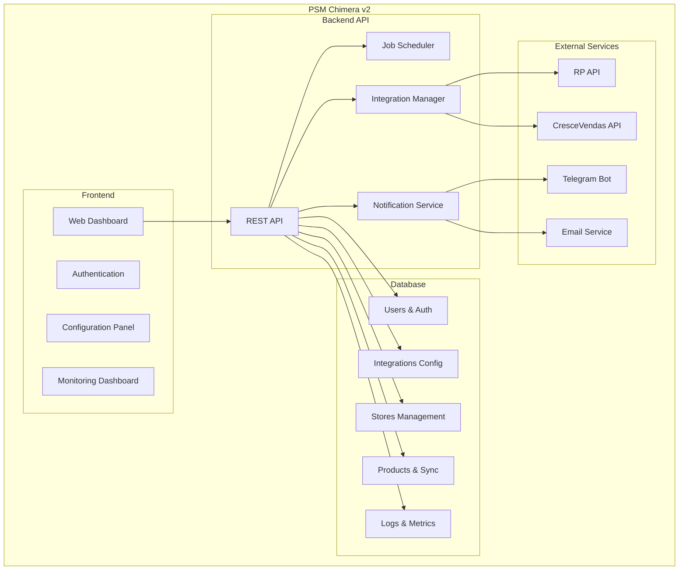

# 🗺️ Plano de Migração: Server-Node-Fill → PSM Chimera v2

**Data de Criação:** 22 de setembro de 2025
**Objetivo:** Migrar sistema legado para arquitetura moderna e configurável
**Duração Estimada:** 3-4 meses

---

## 🎯 Visão Geral da Migração

### 📊 Estado Atual vs. Estado Desejado

| Aspecto | Estado Atual (server-node-fill) | Estado Desejado (PSM Chimera v2) |
|---------|--------------------------------|-----------------------------------|
| **Configuração** | Hardcoded nas ENV | Dinâmica via banco/painel |
| **Integrações** | Fixas no código | Configuráveis via UI |
| **Usuários** | Lista estática Telegram | Gestão completa de usuários |
| **Monitoramento** | Logs em arquivos | Dashboard + métricas |
| **Execução** | Apenas cron/manual | Agendamento flexível |
| **Interface** | Apenas Telegram Bot | Web Dashboard + Bot |
| **Escalabilidade** | Monolítico | Modular e extensível |

---

## 🏗️ Arquitetura Alvo

### Componentes da Nova Arquitetura



---

## 📅 Roadmap de Migração

### 🎯 Fase 1: Fundação (4-6 semanas)

#### **Sprint 1.1: Database Schema Enhancement (1-2 semanas)**

**Objetivos:**

- Expandir schema atual para suportar configurações dinâmicas
- Migrar dados existentes

**Entregas:**

- [ ] **Schema Extensions**
  - Notification settings (Telegram users/groups)
  - Cron job configurations
  - Integration credentials management
  - Audit logs and execution history

- [ ] **Data Models**

  ```prisma
  model NotificationChannel {
    id          Int     @id @default(autoincrement())
    name        String
    type        NotificationType // TELEGRAM, EMAIL, WEBHOOK
    config      Json    // { chat_id, bot_token, etc }
    active      Boolean @default(true)
    created_at  DateTime @default(now())
    updated_at  DateTime @updatedAt
  }

  model JobConfiguration {
    id           Int     @id @default(autoincrement())
    name         String  @unique
    description  String?
    cron_pattern String
    job_type     JobType // SYNC_PRODUCTS, COMPARE_DATA, CLEANUP_LOGS
    config       Json    // Job-specific configuration
    active       Boolean @default(true)
    created_at   DateTime @default(now())
    updated_at   DateTime @updatedAt

    executions JobExecution[]
  }

  model JobExecution {
    id              String   @id @default(uuid())
    job_config_id   Int
    status          ExecutionStatus // PENDING, RUNNING, SUCCESS, FAILED
    started_at      DateTime
    finished_at     DateTime?
    logs            String?
    metrics         Json?

    job_config JobConfiguration @relation(fields: [job_config_id], references: [id])
  }

  enum NotificationType {
    TELEGRAM
    EMAIL
    WEBHOOK
  }

  enum JobType {
    SYNC_PRODUCTS
    COMPARE_DATA
    CLEANUP_LOGS
    CUSTOM
  }

  enum ExecutionStatus {
    PENDING
    RUNNING
    SUCCESS
    FAILED
    CANCELLED
  }
  ```

- [ ] **Migration Scripts**
  - Migrar dados existentes de stores
  - Criar configurações padrão para integrações existentes
  - Importar usuários Telegram atuais

#### **Sprint 1.2: Core Backend API (2-3 semanas)**

**Objetivos:**

- Implementar API REST básica
- Sistema de autenticação
- CRUD para entidades principais

**Entregas:**

- [ ] **Authentication & Authorization**

  ```typescript
  // Routes
  POST /api/v1/auth/login
  POST /api/v1/auth/logout
  POST /api/v1/auth/refresh
  GET  /api/v1/auth/me
  ```

- [ ] **Integrations Management**

  ```typescript
  // Integration CRUD
  GET    /api/v1/integrations
  POST   /api/v1/integrations
  PUT    /api/v1/integrations/:id
  DELETE /api/v1/integrations/:id
  POST   /api/v1/integrations/:id/test    // Test connection
  ```

- [ ] **Stores Management**

  ```typescript
  // Store CRUD with enhanced features
  GET    /api/v1/stores
  POST   /api/v1/stores
  PUT    /api/v1/stores/:id
  DELETE /api/v1/stores/:id
  GET    /api/v1/stores/:id/products
  POST   /api/v1/stores/:id/sync        // Manual sync trigger
  ```

- [ ] **Notification Channels**

  ```typescript
  GET    /api/v1/notifications/channels
  POST   /api/v1/notifications/channels
  PUT    /api/v1/notifications/channels/:id
  POST   /api/v1/notifications/test     // Test notification
  ```

#### **Sprint 1.3: Job Scheduler Foundation (1 semana)**

**Objetivos:**

- Sistema básico de agendamento
- Execução de jobs configuráveis

**Entregas:**

- [ ] **Job Scheduler Service**

  ```typescript
  class JobScheduler {
    async scheduleJob(jobConfig: JobConfiguration): Promise<void>
    async cancelJob(jobId: string): Promise<void>
    async executeJob(jobId: string): Promise<JobExecution>
    async getJobStatus(executionId: string): Promise<JobExecution>
  }
  ```

- [ ] **Job Types Implementation**
  - SyncProductsJob (equivalente ao fazTudo2)
  - CompareDataJob (equivalente ao comparaTudo)
  - CleanupLogsJob (equivalente ao fazTudo3)

- [ ] **Job Configuration API**

  ```typescript
  GET    /api/v1/jobs/configurations
  POST   /api/v1/jobs/configurations
  PUT    /api/v1/jobs/configurations/:id
  POST   /api/v1/jobs/execute/:id        // Manual execution
  GET    /api/v1/jobs/executions         // Execution history
  GET    /api/v1/jobs/executions/:id     // Specific execution details
  ```

---

### 🎨 Fase 2: Frontend Dashboard (3-4 semanas)

#### **Sprint 2.1: Dashboard Foundation (1-2 semanas)**

**Objetivos:**

- Setup básico do frontend
- Sistema de autenticação
- Layout principal

**Entregas:**

- [ ] **Frontend Setup**
  - Next.js 14 com App Router
  - TailwindCSS + Shadcn/ui
  - Zustand para state management
  - React Query para data fetching

- [ ] **Authentication UI**
  - Login/logout pages
  - Protected routes
  - User session management

- [ ] **Main Layout**
  - Navigation sidebar
  - Header com user menu
  - Dashboard overview page

#### **Sprint 2.2: Configuration Panels (1-2 semanas)**

**Objetivos:**

- Interfaces para configuração de integrações
- Gestão de lojas e notificações

**Entregas:**

- [ ] **Integrations Panel**
  - List/create/edit integrations
  - Test connection functionality
  - Credentials management (masked display)

- [ ] **Stores Management**
  - CRUD interface for stores
  - Bulk operations
  - Sync status indicators

- [ ] **Notification Settings**
  - Configure Telegram channels
  - Email settings
  - Webhook configurations
  - Test notification feature

#### **Sprint 2.3: Jobs & Monitoring (1 semana)**

**Objetivos:**

- Interface para gestão de jobs
- Dashboard de monitoramento

**Entregas:**

- [ ] **Job Configuration UI**
  - Create/edit cron jobs
  - Visual cron expression builder
  - Job templates/presets

- [ ] **Monitoring Dashboard**
  - Real-time job execution status
  - Execution history with logs
  - Performance metrics
  - System health indicators

---

### 🔄 Fase 3: Migration & Integration (2-3 semanas)

#### **Sprint 3.1: Legacy Integration Bridge (1-2 semanas)**

**Objetivos:**

- Conectar sistema novo com funcionalidades existentes
- Migração gradual de funcionalidades

**Entregas:**

- [ ] **Integration Adapters**

  ```typescript
  class RpIntegrationAdapter {
    constructor(config: IntegrationConfig) {}
    async authenticate(): Promise<string>
    async getProductsWithDiscount(storeReg: string): Promise<Product[]>
  }

  class CrescevendasIntegrationAdapter {
    constructor(config: IntegrationConfig) {}
    async sendProductsForDiscount(products: Product[]): Promise<CampaignResult>
  }
  ```

- [ ] **Job Implementations**
  - Migrar lógica do fazTudo2 para SyncProductsJob
  - Migrar comparaTudo para CompareDataJob
  - Implementar logging estruturado

- [ ] **Notification Service**

  ```typescript
  class NotificationService {
    async sendTelegramMessage(channelId: string, message: string): Promise<void>
    async sendEmail(to: string, subject: string, body: string): Promise<void>
    async sendJobNotification(execution: JobExecution): Promise<void>
  }
  ```

#### **Sprint 3.2: Data Migration & Testing (1 semana)**

**Objetivos:**

- Migrar dados existentes
- Testes de integração completos

**Entregas:**

- [ ] **Data Migration Scripts**
  - Import existing stores from server-node-fill
  - Import integration configurations
  - Import Telegram user mappings

- [ ] **Testing & Validation**
  - End-to-end tests for critical flows
  - Performance comparison with legacy system
  - User acceptance testing

---

### 🚀 Fase 4: Production & Enhancement (2-3 semanas)

#### **Sprint 4.1: Production Deployment (1 semana)**

**Objetivos:**

- Deploy em produção
- Monitoramento e observabilidade

**Entregas:**

- [ ] **Production Setup**
  - Docker production build
  - Environment configuration
  - Database migration to production

- [ ] **Monitoring & Observability**
  - Application metrics (Prometheus/Grafana)
  - Error tracking (Sentry)
  - Log aggregation
  - Health checks

#### **Sprint 4.2: Legacy Sunset (1-2 semanas)**

**Objetivos:**

- Descomissionamento gradual do sistema antigo
- Validação final

**Entregas:**

- [ ] **Parallel Operation**
  - Run both systems in parallel
  - Compare results and performance
  - Gradual traffic migration

- [ ] **Legacy Decommission**
  - Stop old cron jobs
  - Archive old logs
  - Update documentation
  - Team training on new system

---

## 🎨 Especificações Técnicas Detalhadas

### 📊 Database Schema Extensions

```prisma
// Extending the current schema with new models

model NotificationChannel {
  id           Int                    @id @default(autoincrement())
  name         String                 @unique
  type         NotificationType
  config       Json                   // Flexible config for different types
  active       Boolean                @default(true)
  created_at   DateTime               @default(now())
  updated_at   DateTime               @updatedAt
  deleted_at   DateTime?

  job_notifications JobNotification[]

  @@map("notification_channels")
}

model JobConfiguration {
  id               Int                 @id @default(autoincrement())
  name             String              @unique
  description      String?
  cron_pattern     String              // "0 5 * * *"
  job_type         JobType
  config           Json                // Job-specific configuration
  active           Boolean             @default(true)

  // Relationships
  integration_id   Int?                // Optional: specific integration
  notification_channels JobNotification[]

  created_at       DateTime            @default(now())
  updated_at       DateTime            @updatedAt
  deleted_at       DateTime?

  executions       JobExecution[]
  integration      Integration?        @relation(fields: [integration_id], references: [id])

  @@map("job_configurations")
}

model JobExecution {
  id              String              @id @default(uuid())
  job_config_id   Int
  status          ExecutionStatus
  started_at      DateTime            @default(now())
  finished_at     DateTime?
  logs            String?             // Structured logs
  metrics         Json?               // Performance metrics
  error_details   Json?               // Error stack trace, etc

  job_config      JobConfiguration    @relation(fields: [job_config_id], references: [id])

  @@map("job_executions")
}

model JobNotification {
  id                      Int                 @id @default(autoincrement())
  job_config_id          Int
  notification_channel_id Int

  // When to notify
  on_success             Boolean             @default(false)
  on_failure             Boolean             @default(true)
  on_start               Boolean             @default(false)

  job_config             JobConfiguration    @relation(fields: [job_config_id], references: [id])
  notification_channel   NotificationChannel @relation(fields: [notification_channel_id], references: [id])

  @@unique([job_config_id, notification_channel_id])
  @@map("job_notifications")
}

// Update Integration model to support dynamic configs
model Integration {
  id            Int                 @id @default(autoincrement())
  name          String              @unique
  type          IntegrationType     // RP, CRESCEVENDAS, TELEGRAM, EMAIL
  base_url      String?
  config        Json                // Dynamic configuration

  active        Boolean             @default(true)
  created_at    DateTime            @default(now())
  updated_at    DateTime            @updatedAt
  deleted_at    DateTime?

  integration_keys IntegrationKey[]
  job_configs      JobConfiguration[]

  @@map("integrations")
}

enum NotificationType {
  TELEGRAM
  EMAIL
  WEBHOOK
}

enum JobType {
  SYNC_PRODUCTS
  COMPARE_DATA
  CLEANUP_LOGS
  CUSTOM
}

enum ExecutionStatus {
  PENDING
  RUNNING
  SUCCESS
  FAILED
  CANCELLED
}

enum IntegrationType {
  RP
  CRESCEVENDAS
  TELEGRAM
  EMAIL
  WEBHOOK
}
```

### 🔧 API Specification

#### **Core Authentication**

```typescript
// Authentication endpoints
interface AuthAPI {
  'POST /api/v1/auth/login': {
    body: { email: string; password: string }
    response: { token: string; user: User }
  }

  'POST /api/v1/auth/logout': {
    response: { success: boolean }
  }

  'GET /api/v1/auth/me': {
    response: { user: User }
  }
}
```

#### **Integrations Management**

```typescript
interface IntegrationsAPI {
  'GET /api/v1/integrations': {
    response: { integrations: Integration[] }
  }

  'POST /api/v1/integrations': {
    body: {
      name: string
      type: IntegrationType
      base_url?: string
      config: Record<string, any>
    }
    response: { integration: Integration }
  }

  'PUT /api/v1/integrations/:id': {
    params: { id: string }
    body: Partial<Integration>
    response: { integration: Integration }
  }

  'POST /api/v1/integrations/:id/test': {
    params: { id: string }
    response: { success: boolean; message: string }
  }
}
```

#### **Job Management**

```typescript
interface JobsAPI {
  'GET /api/v1/jobs/configurations': {
    response: { jobs: JobConfiguration[] }
  }

  'POST /api/v1/jobs/configurations': {
    body: {
      name: string
      description?: string
      cron_pattern: string
      job_type: JobType
      config: Record<string, any>
      integration_id?: number
    }
    response: { job: JobConfiguration }
  }

  'POST /api/v1/jobs/execute/:id': {
    params: { id: string }
    response: { execution: JobExecution }
  }

  'GET /api/v1/jobs/executions': {
    query: {
      job_config_id?: string
      status?: ExecutionStatus
      limit?: number
      offset?: number
    }
    response: { executions: JobExecution[]; total: number }
  }

  'GET /api/v1/jobs/executions/:id': {
    params: { id: string }
    response: { execution: JobExecution }
  }

  'GET /api/v1/jobs/executions/:id/logs': {
    params: { id: string }
    response: { logs: string }
  }
}
```

---

## 📋 Checklist de Migração

### ✅ Pré-Migração

- [ ] **Análise Completa**
  - [x] Documentação do sistema atual
  - [x] Identificação de dependências
  - [x] Mapeamento de funcionalidades
  - [ ] Análise de riscos

- [ ] **Preparação do Ambiente**
  - [ ] Setup do novo backend
  - [ ] Configuração do banco de dados
  - [ ] Testes de conectividade com APIs externas

### ✅ Durante a Migração

- [ ] **Desenvolvimento Incremental**
  - [ ] Implementação por fases
  - [ ] Testes contínuos
  - [ ] Code review rigoroso
  - [ ] Documentação atualizada

- [ ] **Validação Contínua**
  - [ ] Comparação de resultados
  - [ ] Performance benchmarks
  - [ ] User acceptance tests

### ✅ Pós-Migração

- [ ] **Operação Paralela**
  - [ ] Monitoramento de ambos os sistemas
  - [ ] Comparação de resultados
  - [ ] Gradual migration de load

- [ ] **Decommission Legacy**
  - [ ] Backup completo dos dados
  - [ ] Documentação de sunset
  - [ ] Treinamento da equipe

---

## ⚠️ Riscos e Mitigações

### 🚨 Riscos Identificados

| Risco | Probabilidade | Impacto | Mitigação |
|-------|--------------|---------|-----------|
| **Perda de Dados** | Baixa | Alto | Backups frequentes + operação paralela |
| **Downtime Operacional** | Média | Alto | Deploy gradual + rollback plan |
| **Performance Degradation** | Média | Médio | Load testing + optimization |
| **Integration Failures** | Alta | Médio | Extensive testing + circuit breakers |
| **User Adoption** | Baixa | Médio | Training + gradual migration |

### 🛡️ Estratégias de Mitigação

1. **Zero-Downtime Migration**
   - Operação paralela durante transição
   - Feature flags para controle gradual
   - Rollback automático em caso de falhas

2. **Data Integrity**
   - Checksums para validação de dados
   - Comparação automática de resultados
   - Logs detalhados de todas as operações

3. **Performance Monitoring**
   - Métricas em tempo real
   - Alertas automáticos
   - Benchmarks contínuos

---

## 📊 Métricas de Sucesso

### 🎯 KPIs Técnicos

- **Performance:** ≤ 200ms response time for API calls
- **Availability:** ≥ 99.9% uptime
- **Reliability:** ≤ 0.1% error rate
- **Scalability:** Support for 10x current load

### 📈 KPIs de Negócio

- **Automation:** 100% elimination of manual configuration
- **Flexibility:** 50% reduction in time to add new integrations
- **Observability:** 100% visibility into all operations
- **User Experience:** ≤ 5 clicks to perform any configuration

---

## 🎉 Conclusão

Este plano de migração oferece uma transição estruturada e segura do sistema atual para uma arquitetura moderna, configurável e escalável. O foco está em:

### ✨ **Benefícios Esperados**

1. **Configurabilidade Completa:** Eliminação de dependências hardcoded
2. **Interface Moderna:** Web dashboard para gestão visual
3. **Flexibilidade Operacional:** Agendamento e execução dinâmica
4. **Observabilidade Avançada:** Monitoramento e métricas em tempo real
5. **Escalabilidade:** Arquitetura preparada para crescimento

### 🚀 **Próximos Passos**

1. **Revisar e aprovar** este plano de migração
2. **Setupar ambiente** de desenvolvimento
3. **Iniciar Fase 1** com o database schema
4. **Estabelecer rituais** de acompanhamento semanal

---

*Plano de Migração PSM Chimera v2*
*Criado em: 22 de setembro de 2025*
*Próxima revisão: Semanal durante execução*
