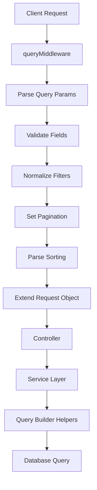

# 🔍 Sistema de Query Unificado - PSM Chimera

## 📋 Visão Geral

O PSM Chimera implementa um sistema de query unificado que centraliza o processamento de filtros, paginação e ordenação através de um middleware modular e reutilizável. Este documento detalha a arquitetura e uso deste sistema.

---

## 🏗️ Arquitetura do Sistema

### Componentes Principais

```plaintext
┌─────────────────────────┐
│    queryMiddleware      │  ← Middleware unificado
├─────────────────────────┤
│    query.type.ts        │  ← Definições de tipos
├─────────────────────────┤
│  query-builder.helper   │  ← Utilitários de query
├─────────────────────────┤
│    Database (Kysely)    │  ← Execução das queries
└─────────────────────────┘
```

### Fluxo de Processamento



---

## 🔧 queryMiddleware

### Configuração

O middleware é configurado por rota com definições de campos permitidos:

```typescript
// backend/src/routes/user.route.ts
router.get('/',
    authenticateToken,
    queryMiddleware({
        name: { type: 'string', sortable: true, filterable: true },
        role: {
            type: 'enum',
            sortable: true,
            filterable: true,
            enumValues: ['ADMIN', 'USER']
        },
        active: { type: 'boolean', sortable: true, filterable: true },
        createdAt: { type: 'date', sortable: true, filterable: false },
        updatedAt: { type: 'date', sortable: true, filterable: false }
    }),
    UserController.getAll
);
```

### Tipos Suportados

| Tipo | Descrição | Validação |
|------|-----------|-----------|
| `string` | Texto livre | Qualquer string |
| `number` | Números inteiros/decimais | Validação numérica |
| `boolean` | Valores booleanos | `true`, `false`, `1`, `0` |
| `date` | Datas ISO | Formato ISO 8601 |
| `enum` | Valores predefinidos | Lista em `enumValues` |

### Configuração Simplificada

```typescript
// Sintaxe curta para campos comuns
queryMiddleware({
    name: 'string',     // Equivale a { type: 'string', sortable: true, filterable: true }
    email: 'string',
    role: { type: 'enum', enumValues: ['ADMIN', 'USER'] }
})
```

---

## 📊 Tipos de Query

### FilterResult

```typescript
interface FilterResult {
    search?: { eq: string };                    // Busca global
    [field: string]: {                         // Filtros específicos
        eq?: any;           // Equal
        ne?: any;           // Not equal
        gt?: any;           // Greater than
        gte?: any;          // Greater than or equal
        lt?: any;           // Less than
        lte?: any;          // Less than or equal
        in?: any[];         // In array
        nin?: any[];        // Not in array
        like?: string;      // SQL LIKE
        ilike?: string;     // Case-insensitive LIKE
        contains?: string;  // Contains substring
        startsWith?: string;// Starts with
        endsWith?: string;  // Ends with
        isNull?: boolean;   // Is null
        isNotNull?: boolean;// Is not null
    };
}
```

### PaginationResult

```typescript
interface PaginationResult {
    limit: number;    // Itens por página (padrão: 10, máx: 100)
    offset: number;   // Itens a pular (calculado de page)
}
```

### SortingResult

```typescript
type SortingResult = Record<string, 'asc' | 'desc'>;
```

---

## 🛠️ Query Builder Helpers

### applyFilters

Aplica filtros com mapeamento de colunas e busca em múltiplos campos:

```typescript
// backend/src/services/user.service.ts
const columnMapping = {
    'active': 'users.active',
    'role': 'users.role',
    'email': 'users.email',
    'name': 'users.name',
    'createdAt': 'users.createdAt',
    'updatedAt': 'users.updatedAt'
};

const searchFields = ['users.name', 'users.email'];

query = applyFilters({
    query,
    filters,
    columnMapping: columnMapping,
    searchFields: searchFields
});
```

### applyPagination

```typescript
query = applyPagination(query, pagination);
```

### applySorting

```typescript
query = applySorting(
    query,
    sorting || { createdAt: 'desc' },
    columnMapping
);
```

---

## 🌐 Uso nas APIs

### URLs de Exemplo

```bash
# Busca simples
GET /api/v1/users?search=joão

# Filtros específicos
GET /api/v1/users?name[like]=joão&active[eq]=true

# Paginação
GET /api/v1/users?page=2&limit=20

# Ordenação
GET /api/v1/users?sort=name:asc,createdAt:desc

# Combinado
GET /api/v1/users?search=admin&role[eq]=ADMIN&active[eq]=true&page=1&limit=10&sort=name:asc
```

### Sintaxe de Filtros

| Operador | Sintaxe URL | Exemplo |
|----------|-------------|---------|
| Equal | `field[eq]=value` | `active[eq]=true` |
| Not Equal | `field[ne]=value` | `role[ne]=ADMIN` |
| Greater Than | `field[gt]=value` | `id[gt]=10` |
| Greater/Equal | `field[gte]=value` | `createdAt[gte]=2024-01-01` |
| Less Than | `field[lt]=value` | `id[lt]=100` |
| Less/Equal | `field[lte]=value` | `createdAt[lte]=2024-12-31` |
| In Array | `field[in]=val1,val2` | `role[in]=ADMIN,USER` |
| Not In Array | `field[nin]=val1,val2` | `status[nin]=DELETED` |
| Like | `field[like]=pattern` | `name[like]=%joão%` |
| Case-insensitive | `field[ilike]=pattern` | `email[ilike]=%GMAIL%` |
| Contains | `field[contains]=text` | `name[contains]=silva` |
| Starts With | `field[startsWith]=text` | `name[startsWith]=João` |
| Ends With | `field[endsWith]=text` | `email[endsWith]=@gmail.com` |
| Is Null | `field[isNull]=true` | `deletedAt[isNull]=true` |
| Is Not Null | `field[isNotNull]=true` | `lastLogin[isNotNull]=true` |

---

## 💻 Implementação no Controller

### Padrão Utilizado

```typescript
// backend/src/controllers/user.controller.ts
export class UserController {
    static getAll(req: AuthenticatedRequest, res: Response) {
        // Extrai dados processados pelo middleware
        const filters = req.filters || {};
        const pagination = req.pagination || { limit: 10, offset: 0 };
        const sorting = req.sorting || { createdAt: 'desc' };

        return userService.getAllUsers(filters, pagination, sorting)
            .then(result => {
                const { data, total } = result;

                return res.status(200).json({
                    data,
                    pagination: {
                        limit: pagination.limit,
                        offset: pagination.offset,
                        total: total,
                    }
                });
            })
            .catch(error => {
                console.error('Erro ao buscar usuários:', error);
                res.status(500).json({
                    error: 'Erro interno do servidor ao buscar usuários'
                });
            });
    }
}
```

---

## 🔍 Implementação no Service

### Padrão com Mapeamento de Colunas

```typescript
// backend/src/services/user.service.ts
getAllUsers(filters: FilterResult, pagination: PaginationResult, sorting?: Record<string, 'asc' | 'desc'>): Promise<UserListData> {
    // Mapeia campos da API para colunas do banco
    const columnMapping = {
        'active': 'users.active',
        'role': 'users.role',
        'email': 'users.email',
        'name': 'users.name',
        'createdAt': 'users.createdAt',
        'updatedAt': 'users.updatedAt'
    };

    // Define campos onde busca global deve procurar
    const searchFields = ['users.name', 'users.email'];

    return new Promise((resolve, reject) => {
        let query = db
            .selectFrom('users')
            .leftJoin('authentications', 'users.id', 'authentications.user_id')
            .select([/* campos */])
            .where('users.deletedAt', 'is', null);

        // Aplica filtros com mapeamento
        query = applyFilters({
            query,
            filters,
            columnMapping: columnMapping,
            searchFields: searchFields
        });

        // Aplica ordenação
        query = applySorting(query, sorting || { createdAt: 'desc' }, columnMapping);

        // Query de contagem
        let countQuery = db
            .selectFrom('users')
            .select(db.fn.count('users.id').as('total'))
            .where('users.deletedAt', 'is', null);

        // Aplica mesmos filtros à contagem
        countQuery = applyFilters({
            query: countQuery,
            filters,
            columnMapping: columnMapping,
            searchFields: searchFields
        });

        // Aplica paginação
        query = applyPagination(query, pagination);

        // Executa em paralelo
        Promise.all([
            countQuery.executeTakeFirstOrThrow(),
            query.execute()
        ])
        .then(([countResult, data]) => {
            resolve({
                data: mappedData,
                total: Number(countResult.total)
            });
        })
        .catch(reject);
    });
}
```

---

## ✨ Vantagens do Sistema

### 1. Consistência

- Processamento uniforme em todas as rotas
- Validação padronizada de parâmetros
- Tratamento de erros centralizado

### 2. Type Safety

- Tipos TypeScript completos
- Validação em tempo de execução
- Extensão da interface Express

### 3. Flexibilidade

- Configuração por rota
- Suporte a múltiplos tipos de dados
- Mapeamento de colunas customizável

### 4. Performance

- Queries otimizadas com Kysely
- Busca case-insensitive com ILIKE
- Paginação eficiente

### 5. Manutenibilidade

- Código centralizado e reutilizável
- Logs detalhados para debug
- Documentação clara

---

## 🚀 Próximos Passos

### Melhorias Planejadas

1. **Cache de Queries**
   - Redis para queries frequentes
   - Invalidação inteligente

2. **Validação Avançada**
   - Validação de ranges de datas
   - Validação de relacionamentos

3. **Agregações**
   - Suporte a GROUP BY
   - Funções agregadas (COUNT, SUM, AVG)

4. **Full-Text Search**
   - Busca em múltiplas tabelas
   - Ranking de relevância

---

*Documentação do Sistema de Query Unificado*
*Última atualização: 23 de dezembro de 2024*
